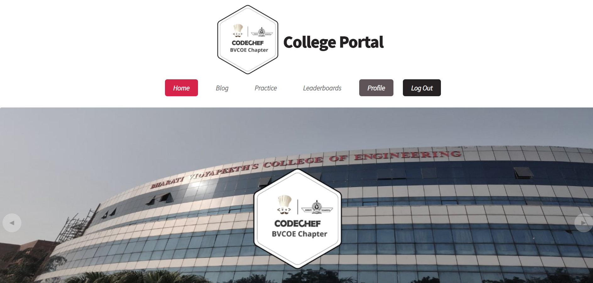
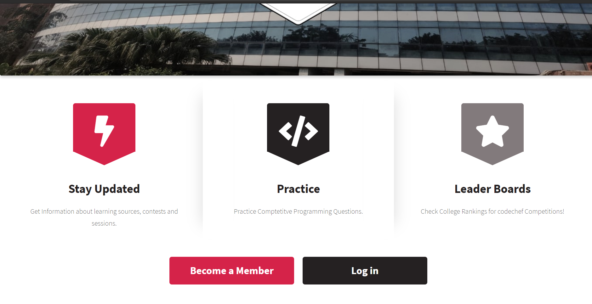
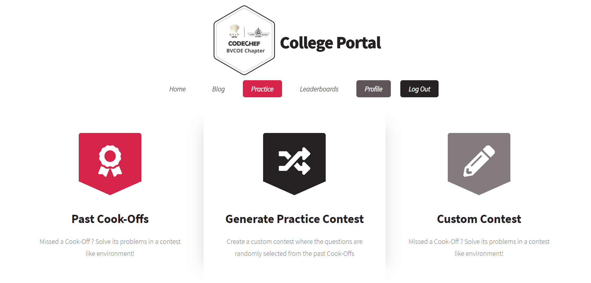
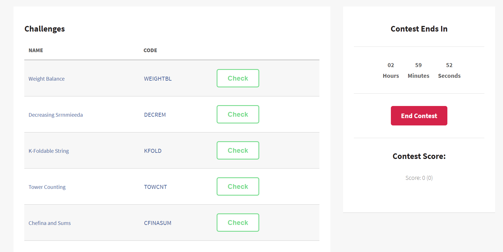
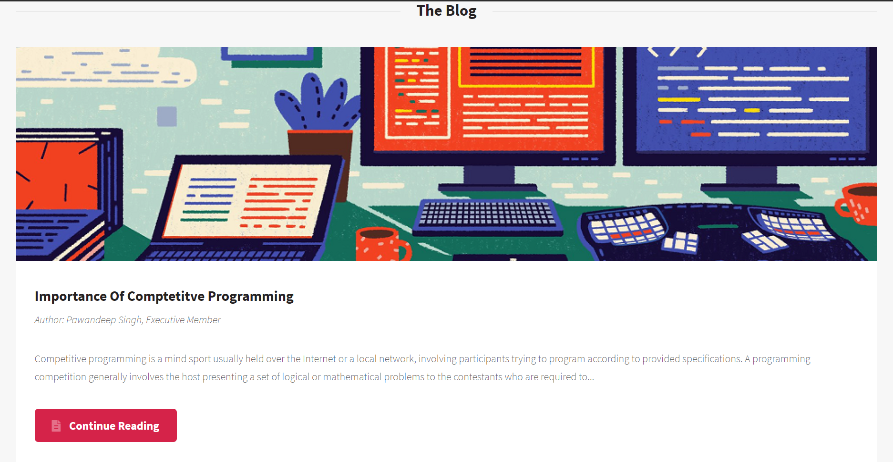
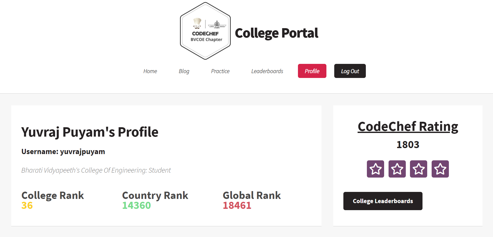
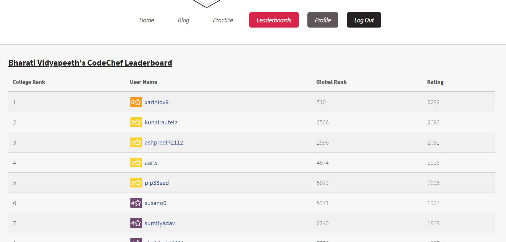
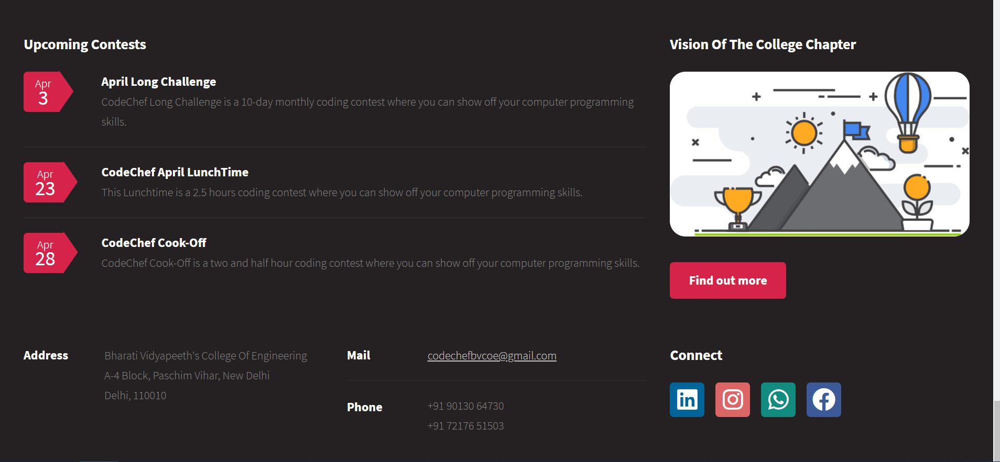

# CodeChef BVCOE College Portal
<h5>Live website: <a href="https://codechefbvcoeportal.herokuapp.com/" target="_blank">CodeChef BVCOE College Portal </a></h5>
<h2>About CodeChef College Chapter</h2>

CodeChef College Chapters are the programming clubs run and maintained by the official chapter leaders and mentored by CodeChef. They aim to make learning competitive programming accessible for students across the globe.
  
The mission of CodeChef College Chapters is to empower Chapter Leaders to build a robust Competitive Programming culture on campuses and to help students become better problem solvers fostering learning and professional development.

 
They are responsible for conducting different activities and engagements to achieve the mission

CodeChef Platform Link  <a href="https://www.codechef.com/">CodeChef</a>

<h2>The Gallery of Computation</h2>

<h4>A fully fullstack college Portal. Built with Django, SQLite, CodeChef API to fetch data and Oauth provided by CodeChef</h4>
<h3>Features</h3>
<ol>
   <li>Fully functional practice section where members can create,participate in contests as well as past contests.</li>
   <li>Online Auth via CodeChef</li>
   <li>Dynamic College Leaderboard and Contest leaderboards</li>
   <li>Profile section for college user.</li>
   <li>Blog with updated articles</li>
</ol>
<h5>College Portal Screenshots</h5>
<ul>
   <li>
      <h4>Landing Page</h4>
      
    </li>
    <li>
      
    </li>
   <li>
      <h4>Practice Page</h4>
      
     </li>
      <li>
      
    </li>
   <li>
      <h4>Blog Page</h4>
      
    </li>
   <li>
      <h4>Profile Page</h4>
      
    </li>
   <li>
      <h4>Leaderboards</h4>
      
    </li>
   <li>
      <h4>Footer</h4>
           
    </li>
</ul>
